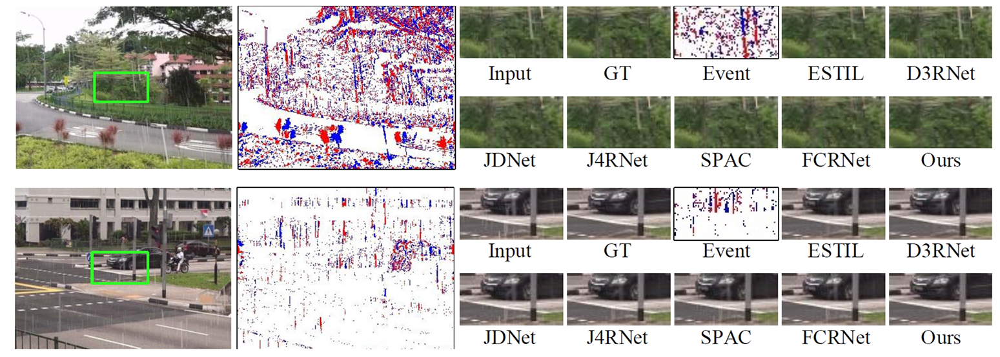
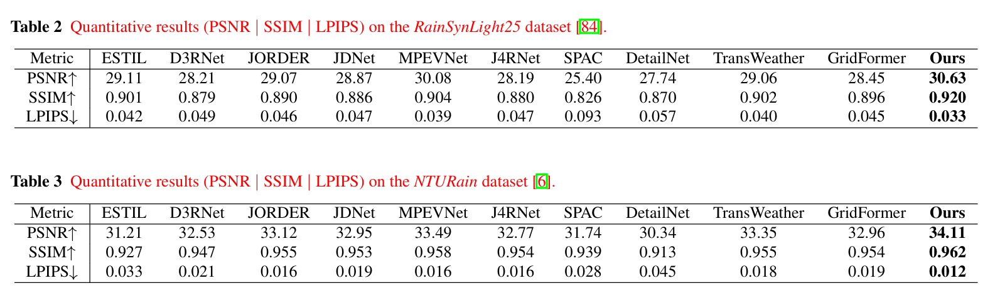

# EHN

<!--  -->
<!--  -->

This repository provides the official PyTorch implementation of the following paper:

**Event-driven Heterogeneous Network for Video Deraining**


<!-- IEEE Transactions on Neural Networks and Learning Systems -->

<!-- [Paper Link](https://ieeexplore.ieee.org/abSCNetct/document/10314003) -->


## Dependencies

- Python
- scikit-image
- opencv-python
- pytorch == 1.8.0+cu111
- torchvision == 0.9.0+cu111
- numpy == 1.19.2
- h5py == 3.3.0
- Win10 or Ubuntu18.04


## Dataset


- Download Derain dataset：
  - Synlight: https://pan.baidu.com/s/1YiSLRVZSvyXziX2qxAruTw (e2xt) 
  - Synheavy: https://pan.baidu.com/s/1alRpMX_ZT6K5wh18bUw1aA (9n9w)
  - NTU: https://pan.baidu.com/s/17a6vlVGq5gcbiP9yxbnpzQ (lmdv)


- Unzip files ```dataset``` folder.


After preparing data set, the data folder should be like the format below:

```
Synheavy
├─ train
│ ├─ input    
│ │ ├─ ......
│ │
│ ├─ GT
│ │ ├─ ......
│
│ ├─ mat
│ │ ├─ ......
│
│ ├─ H5
│ │ ├─ ......
│
├─ test
│ ├─ input    
│ │ ├─ ......
│ │
│ ├─ GT
│ │ ├─ ......
│
│ ├─ mat
│ │ ├─ ......
│
│ ├─ H5
│ │ ├─ ......
│
```


## Train

To train SCNet , run the command below:

``` python train_derain_real.py -opt your_option.yml -save_dir your_save_path```

Model weights will be saved in ``` results/model_name/weights``` folder.


## Performance






<!-- ## Citation -->

<!-- ```
@ARTICLE{10314003,
  author={Cao, Chengzhi and Fu, Xueyang and Zhu, Yurui and Sun, Zhijing and Zha, Zheng-Jun},
  journal={IEEE Transactions on Neural Networks and Learning Systems}, 
  title={Event-Driven Video Restoration With Spiking-Convolutional Architecture}, 
  year={2023},
  volume={},
  number={},
  pages={1-15},
  keywords={Image restoration;Feature extraction;Correlation;Computer architecture;Cameras;Task analysis;Superresolution;Convolutional neural networks (CNNs);event camera;spiking neural networks (SNNs);video restoration},
  doi={10.1109/TNNLS.2023.3329741}}
``` -->

<!-- ## Notes and references
The  code is based on the paper:

'Rethinking Coarse-to-Fine Approach in Single Image Deblurring'(https://arxiv.org/abs/2108.05054)

'Event-driven Video Deblurring via Spatio-Temporal Relation-Aware Network'(https://www.ijcai.org/proceedings/2022/112) -->


## Contact
If you have any question, please contact chengzhicao@mail.ustc.edu.cn.

